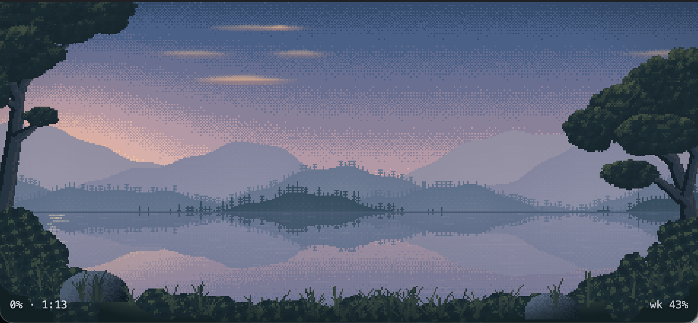

# Stay awhile

A little atmosphere to keep you with the task.



A Claude Code plugin with ambient audio and living pixel-art landscapes,
designed to help you stay with one task while Claude works.

- **Hear when your attention is needed.** Music plays during a turn; distinct
  cues mark completion, failure, and requests for your input.
- **Keep a quiet landscape nearby.** Choose from four animated scenes in a
  browser or a small, always-on-top window.
- **See your usage at a glance.** The sun and moon follow your usage window,
  with percentages, reset time, and optional turn history.
- **Make it yours from the viewer.** Change music, volume, and scene through
  the gear menu—no trip to `/config` needed.

## Quick start

You’ll need Claude Code and an audio player: macOS includes `afplay`; Windows
uses PowerShell and needs [Git for Windows](https://gitforwindows.org/) for
Bash; Linux needs `paplay`, `aplay`, or `ffplay`.

The optional viewer also needs **Python 3** (`python3` or `python` on `PATH`).
Use **Chrome or Edge** for the floating window. See the
[platform guide](docs/platforms.md) for details, including Windows setup.

Run these commands inside Claude Code:

```text
/plugin marketplace add sandorkan/stay-awhile
/plugin install stay-awhile@stay-awhile-marketplace
/reload-plugins
/stay-awhile:init
/stay-awhile:show
```

Run `/reload-plugins` after installation to load the plugin into the current
session before testing audio or running its commands.

Audio works without viewer setup. To use the usage display, `init` shows the
status-line change and asks before saving it. It can preserve an existing
status line by appending Stay awhile’s readout. A custom status line replaces
some of Claude Code’s footer hints.

When the viewer opens, click **Open the window** to pop out the scene. Keep the
launcher open; you can minimise it. For an ordinary browser tab instead, add
`?dev` to the viewer URL.

## Change settings in the viewer

Hover over the scene and click the **gear in the top-right corner**. The same
settings are available in the browser scene and the floating window:

| Setting | What it does |
|---|---|
| **Scene** | Switch immediately between Lakeside, Alpine Valley, Coastal Lighthouse, and Desert Canyon. |
| **Music** | Choose a track, shuffle a category, or select **Off**. |
| **Volume** | Adjust the volume with a slider. |
| **Show turn stats** | Show or hide today’s turn-history bars. |

Music and volume save to Claude’s plugin settings and apply when a new loop
starts on a later turn, without restarting Claude. The current loop keeps its
track and volume. Scene and turn-stats preferences are remembered in your
browser. Press Escape or click outside the panel to close it.

You can still use `/config` for plugin options, including completion cues and
the look-away reminder. `/stay-awhile:music` provides short track previews.
See [audio and configuration](docs/audio.md) for the full track list, defaults,
breathing patterns, and customization.

## Four places to settle in

| Scene | Atmosphere |
|---|---|
| **Lakeside** | Forest reflections, drifting clouds, occasional lake rings, and dusk fireflies. |
| **Alpine Valley** | Snow-lit peaks, pine forests, valley mist, and a winding river. |
| **Coastal Lighthouse** | Ocean swells, rocky cliffs, and a lighthouse beam after dusk. |
| **Desert Canyon** | Warm sandstone terraces, a sandy wash, dry scrub, and subtle drifting dust. |

The light changes as you use your five-hour allowance: dawn gives way to day
and sunset, then the moon tracks the reset when the allowance is spent.
This is a **usage cycle**, not your local time of day or a task-progress estimate.
Movement settles when Claude is idle or waiting for input; birds lift when a
turn completes.

The corner labels show percentages **used**, not remaining. For example,
`18% · 1:35` means 18% used and one hour, 35 minutes until the five-hour reset.
`wk 46%` means 46% of the weekly allowance used.

Turn stats show up to 120 completed turns from today. Hover, tap, or use arrow
keys on a bar to inspect its duration and outcome. Press `b` to toggle the strip.

## Commands

| Command | Purpose |
|---|---|
| `/stay-awhile:init` | Set up the usage status line; review changes before applying. |
| `/stay-awhile:show` | Start the local viewer and open its launcher. |
| `/stay-awhile:close` | Close the viewer and stop its server. |
| `/stay-awhile:music` | Preview tracks and choose one. |

## Why stay awhile?

A slow turn can be an invitation to open another session. Sometimes that’s
useful; sometimes it means leaving a task just as you were getting into it.
Stay awhile offers a small alternative: something pleasant to hear and see
while you keep your place in the work.

The loop tells you Claude is working, and the cues tell you when to return.
You can look away or take a short break without watching the terminal.
It won’t prevent switching sessions or guarantee focus—it simply makes staying
with one task a little more inviting.

## Troubleshooting

| What you notice | What to check |
|---|---|
| **No usage numbers, or a dash** | Run `/stay-awhile:init`, then complete a Claude turn. Numbers depend on Claude supplying rate-limit data; they can be absent before the first response or after a window resets. See [usage setup](docs/viewer.md#status-line-and-usage-data). |
| **No sound** | Audio plays while a turn is running. Check that Music isn’t **Off**, volume is above zero, and an audio player is available. See [platform requirements](docs/platforms.md). |
| **The floating window won’t open** | Use Chrome or Edge and click **Open the window**. Other browsers can show the scene in a tab with `?dev`. |
| **Music or volume hasn’t changed yet** | Changes apply to a new loop, not one already playing. If several sessions are active, they share the existing loop until all active turns stop. |
| **The viewer needs restarting** | Run `/stay-awhile:close`, then `/stay-awhile:show`. |
| **Music continues after pressing Esc** | The plugin may not receive an immediate stop event. It stops when Claude reports the session idle; interrupt handling has this limitation. |

Multiple sessions share one background loop, and sound cues don’t identify
which session finished. Closing the pop-out returns to its launcher; use
`/stay-awhile:close` to stop the viewer explicitly.

## Local data

The plugin keeps turn counts, timings, session IDs, and project folder names
in a local log. It reads the transcript locally to calculate prompt metrics,
but the log does not contain prompt text or file contents.

The status-line integration separately caches **the full payload Claude sends
it**, which may contain paths and other session metadata. The viewer reads
that data through a local server; the plugin does not upload it to an external
service. See [local data and turn history](docs/data.md) for paths, fields, and
analysis examples.

## Further reading

- [Audio, options, and custom sounds](docs/audio.md)
- [Viewer setup and internals](docs/viewer.md)
- [Platform requirements and Windows notes](docs/platforms.md)
- [Local data and turn-history analysis](docs/data.md)
- [Development and testing](docs/development.md)
- [Upgrading from an earlier version](docs/upgrading.md)

## Support

If Stay awhile makes your coding sessions a little calmer, you can
[buy me a coffee](https://buymeacoffee.com/sandorkan). Thanks for supporting the project ☕

## License

Code and documentation: [MIT](LICENSE). Audio synthesized by
`scripts/gen-sounds.py` is released under CC0. The soundscapes in
`sounds/soundscapes/` were produced with ElevenLabs and are separate from
that synthesized-audio CC0 statement.
